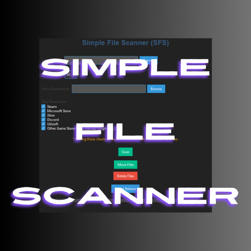

# Simple File Scanner (SFS)



Simple File Scanner (SFS) is a Python application designed to scan a directory for unused files that have not been accessed within a specified number of days. The application features a modern, dark-themed graphical user interface (GUI) built with `ttkbootstrap`.

## Features

- Scan a selected directory for unused files.
- Option to skip directories related to gaming (e.g., Steam, Microsoft Store, Xbox, etc.).
- Skips core Windows system directories to avoid accidental deletion of critical system files.
- Displays a progress bar during the scan.
- Generates a list of unused files in `FoundFiles.txt`.
- Option to move unused files to a designated directory for deletion.
- Option to permanently delete unused files.
- Provides a link to the latest release.

## Installation

### Prerequisites

- Python 3.6 or higher

### Steps

1. Clone this repository or download the ZIP file and extract it.
2. Navigate to the project directory.
3. Install the required packages by running the `install.bat` script.

### Using the Install Script

To install the required dependencies, you can use the provided `install.bat` file.

```bat
@echo off
echo Installing required packages...
pip install -r requirements.txt
echo Installation complete. You can now run the application with 'python SFS.py'.
pause
```

## Usage

1. **Launch the Application**: Run `python SFS.py` to start the application.
2. **Select Folder**: Click on the "Browse" button to select the directory you want to scan.
3. **Set Days Unused**: Enter the number of days in the "Days Unused" field to specify the age threshold for unused files.
4. **Specify Move Destination**: Click on the "Browse" button next to "Move Destination" to choose the directory where unused files will be moved.
5. **Skip Directories**: Check the boxes to skip scanning specific directories (e.g., Steam, Microsoft Store).
6. **Scan for Unused Files**: Click the "Scan" button to start scanning. The progress bar will indicate the progress.
7. **Move Files**: Click the "Move Files" button to move the found unused files to the specified directory.
8. **Delete Files**: Click the "Delete Files" button to permanently delete the found unused files.

## Modules

- **FileRemover.py**: Contains the `delete_files` function to remove files from the filesystem.
- **MoveFiles.py**: Contains the `move_files` function to move files to a specified directory.
- **SFS.py**: The main script that launches the GUI and integrates the file scanning, moving, and deleting functionalities.

## Contributing

If you would like to contribute to this project, please fork the repository and submit a pull request.

## License

This project is licensed under the Apache License 2.0. See the [LICENSE](https://github.com/VVoiddd/Simple-File-Scanner/blob/main/LICENSE) file for more details.

## Acknowledgements

- The application uses `ttkbootstrap` for a modern GUI.
- Thanks to `tkinterdnd2` for enabling drag and drop functionality.

## Latest Release

For the latest release, visit the [Simple File Scanner GitHub Releases](https://github.com/VVoiddd/Simple-File-Scanner).
```

This ensures that core Windows system directories are skipped during the scan, reducing the risk of accidental deletion of critical system files.